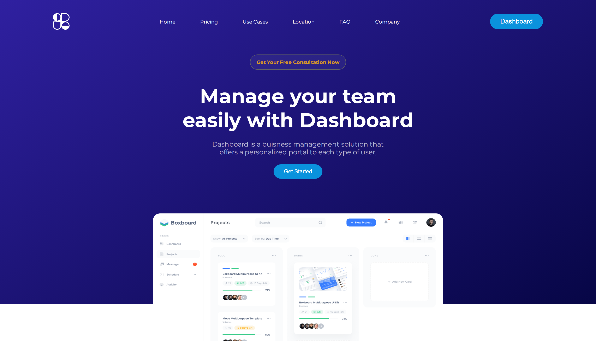

# CRUD Dashboard on React

CRUD Web Application. This small Dashboard can - Create new users, Read data from storage, Update existing users data, and Delete users.

---



## Features

- Create users
- Update users
- Delete users
- Manage data in localStorage

## Run Locally

Clone the project

```bash
  git clone https://github.com/NemoX12/landing-page-react.git
```

Go to the project directory

```bash
  cd landing-page-react
```

Install dependencies

```bash
  npm install
```

Start the server

```bash
  npm run dev
```

## Authors

- [NemoX12 - Developer](https://www.github.com/NemoX12)

## Acknowledgements

- [Logo](https://logoipsum.com)

- [Icons](https://www.npmjs.com/package/react-icons)
